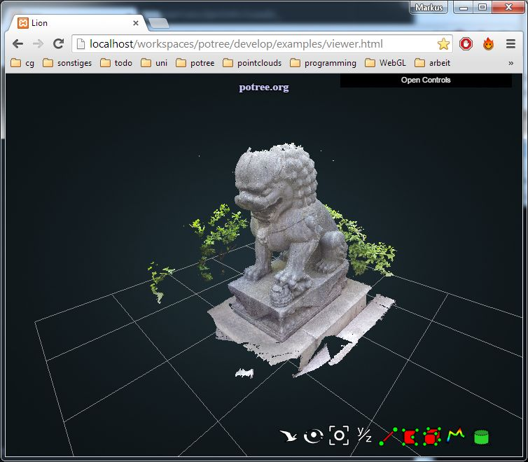

# Getting Started

## Including Source Files

This example needs three.js, OrbitControls.js, and the potree source files:

    
    
    
    
    
    
    
    
    

## Setting Up The Scene

In this section, we will set up a simple scene to load and display a point cloud.

Potree is built upon the three.js library and so the first step is to
create a three.js scene, camera and renderer:

    scene = new THREE.Scene();
    camera = new THREE.PerspectiveCamera(75, window.innerWidth/window.innerHeight, 0.1, 100000);
    renderer = new THREE.WebGLRenderer();
    renderer.setSize(window.innerWidth, window.innerHeight);
    document.body.appendChild(renderer.domElement);

In the next step, we move the camera to position 1 / 7 / 7 and make it point
to the target at 0 / 4 / 0. The OrbitControls makes it possible to rotate around
the target by dragging the mouse.

    camera.position.set(1, 7, 7);
    controls = new THREE.OrbitControls(camera, renderer.domElement);
    controls.target.set(0, 4, 0 );
    camera.lookAt(controls.target);

In the next few steps, we will load the pointcloud, modify its position and orientation
and add it to the scene.

First, load the pointcloud:

    var pco = POCLoader.load(pointcloudPath);

POCLoader.load() returns a geometry object. Geometry objects can be attached to
scene nodes, PointCloudOctree in this case, which in turn can be added to the scene:

    pointcloudMaterial = new THREE.PointCloudMaterial( { size: defaultPointSize, vertexColors: true } );
    pointcloud = new Potree.PointCloudOctree(pco, pointcloudMaterial);
    scene.add(pointcloud);

It is possible to create multiple scene nodes that use the same geometry, if needed.

Usually, the position and orientation of pointclouds must be modified as well.
Use _moveToOrigin()_ if you want to center your pointcloud around the origin and
 _moveToGroundPlane()_ to put it on top of the ground plane.
 Change the LOD parameter to alter the Level of Detail. A higher LOD results in
 more octree nodes beeing displayed at once. If you experience performance problems,
 try to lower the LOD.

    pointcloud.LOD = defaultLOD;
    pointcloud.rotation.set(Math.PI/2, 0.85* -Math.PI/2, -0.0);
    pointcloud.moveToOrigin();
    pointcloud.moveToGroundPlane();

A common problem is that your pointcloud is upside down or the y and z axis are
flipped. In three.js / WebGL y points upwards while a lot of software packages
use z as the up-vector.

To fix the upside down problem, you an apply a matrix transformation to mirror
along the y axis:

    pointcloud.applyMatrix(new THREE.Matrix4().set(
        1,0,0,0,
        0,-1,0,0,
        0,0,1,0,
        0,0,0,1
    ));

To fix the problem with flipped y and z axis, you an apply another matrix transformation:

    pointcloud.applyMatrix(new THREE.Matrix4().set(
        1,0,0,0,
        0,0,1,0,
        0,1,0,0,
        0,0,0,1
    ));

## Rendering the Scene

pointcloud.update(camera) loads nodes that are visible from the given camera
and hides nodes that are not.

    pointcloud.update(camera);

Render the scene:

    renderer.render(scene, camera);

## Putting It All Together

This is a complete html file that will display the lion_takanawa pointcloud
that is included in the potree repository.
Make sure to put the html file into the potree root dir (not ./examples) or update
the pointcloudPath variable.

    <html>
    <head>
    	<title>Lion</title>
    	
    </head>
    <body style="margin: 0; padding: 0">

    	
    	
    	
    	
    	
    	
    	
    	
    	

    	

    </body>
    </html>

## Deploying Potree On A Webserver

Due to strict security policies in browsers,
it is not possible to open potree html files directly on your pc because
potree needs permission to load files.
You have to put all necessary source files and the pointcloud on a webserver
to view the result. You can, however, install a local webserver on your pc.
I use XAMPP, which contains Apache Webserver as well as PHP and MySQL but Apache
alone should work fine:
* [Apache](http://httpd.apache.org/)
* [XAMPP](https://www.apachefriends.org/de/index.html)

After you've installed apache/XAMPP, start it and copy your potree directory
to the htdocs directory. You should now be able to access your localy hosted files like this:

    http://localhost/potree/pointcloud.html

